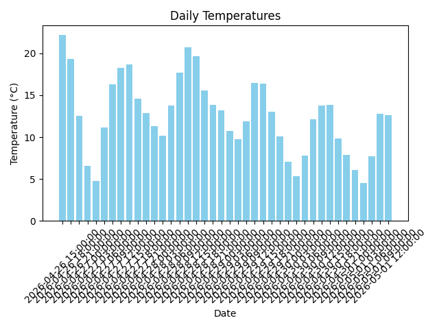
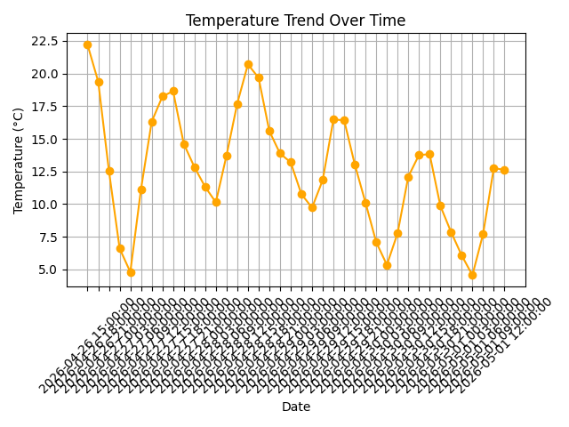

# Weather Forecast Analysis

## Project Overview
This project demonstrates how to fetch and analyze weather forecast data using an external API.  
We retrieve daily temperature forecasts, calculate averages, and visualize distributions and trends.

## Technologies Used
- Python 3.14
- Requests (API calls)
- Pandas (data analysis)
- Matplotlib (visualization)

## Dataset
Data is fetched from the [OpenWeatherMap API](https://openweathermap.org/api).  
The script `forecast.py` saves the data into `forecast.csv`.

## Scripts
- `forecast.py` → Fetches weather forecast data from API and saves it to CSV.  
- `chart.py` → Creates bar charts showing daily temperatures.  
- `trend.py` → Creates line charts showing temperature trends.  

## How to Run
1. Install dependencies:
pip install requests pandas matplotlib
2. Run forecast fetch:
python forecast.py
3. Run charts:
python chart.py
python trend.py

## Results
- Weather forecast data is retrieved and stored in `forecast.csv`.  
- Bar charts show daily temperatures.  
- Line charts show temperature trends over time.  

### Charts
  

### Trends

